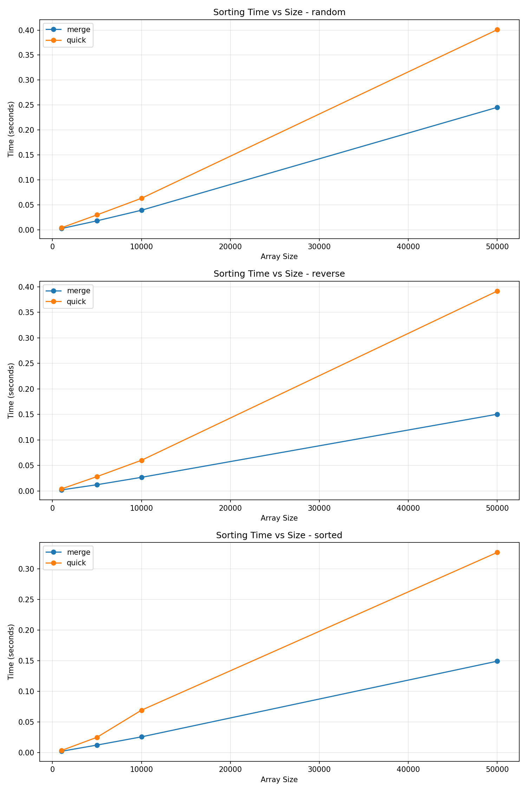

# Divide-and-Conquer Sorting Algorithms Benchmark

A comprehensive Python project for benchmarking merge sort and quick sort algorithms across different dataset types and sizes, with detailed performance metrics, logging, and visualization.

## Project Overview

This project implements two divide-and-conquer sorting algorithms (Merge Sort and Quick Sort) and provides a benchmarking framework to evaluate their performance across various dataset characteristics:

- **Merge Sort**: Stable, O(n log n) worst-case time complexity
- **Quick Sort**: In-place, O(n log n) average-case with configurable pivot strategies

The benchmark suite measures:
- Wall-clock time (using `time.perf_counter`)
- Peak memory usage (using `tracemalloc` and `psutil`)
- Comparison and swap counts (when instrumentation is enabled)
- Correctness verification (comparing against Python's `sorted()`)

## Project Structure

```
.
├── src/
│   ├── algorithms/
│   │   ├── merge_sort.py      # Merge sort implementation
│   │   └── quick_sort.py       # Quick sort with pivot strategies
│   └── bench/
│       ├── benchmark.py         # Main CLI benchmark runner
│       ├── datasets.py          # Dataset generators
│       ├── metrics.py           # Performance measurement utilities
│       └── logging_setup.py     # Logging configuration
├── tests/
│   └── test_sorts.py            # Comprehensive test suite
├── scripts/
│   └── run_benchmarks.sh        # Convenience script to run benchmarks
├── results/                     # Auto-created: CSV, JSON, logs
├── plots/                       # Auto-created: PNG visualizations
├── pyproject.toml               # Project configuration and dependencies
├── .gitignore
└── README.md                    # This file
```

## Installation

### Prerequisites

- Python 3.8 or higher
- pip (Python package manager)

### Setup

1. Clone the repository:
```bash
git clone <repository-url>
cd divide-and-conquer-analysis
```

2. Install dependencies:
```bash
pip install -e .
```

Or install from `pyproject.toml`:
```bash
pip install -e ".[dev]"  # Includes dev dependencies (mypy, ruff, black)
```

## Quick Start

### Run a Simple Benchmark

```bash
python -m src.bench.benchmark \
    --algorithms merge,quick \
    --datasets sorted,reverse,random \
    --sizes 1000,5000,10000 \
    --runs 5 \
    --seed 42 \
    --instrument \
    --make-plots
```

### Use the Convenience Script

```bash
./scripts/run_benchmarks.sh
```

## CLI Usage

The benchmark CLI (`src.bench.benchmark`) supports the following arguments:

### Required Arguments

None (all have defaults)

### Optional Arguments

- `--algorithms`: Comma-separated list of algorithms to benchmark
  - Options: `merge`, `quick`
  - Default: `merge,quick`

- `--pivot`: Pivot strategy for Quick Sort
  - Options: `first`, `last`, `median_of_three`, `random`
  - Default: `random`

- `--datasets`: Comma-separated list of dataset types
  - Options: `sorted`, `reverse`, `random`, `nearly_sorted`, `duplicates_heavy`
  - Default: `sorted,reverse,random,nearly_sorted,duplicates_heavy`

- `--sizes`: Comma-separated list of dataset sizes
  - Default: `1000,5000,10000,50000`
  - Example: `--sizes 1000,5000,10000,50000,100000`

- `--runs`: Number of runs per experiment (for statistical significance)
  - Default: `5`

- `--seed`: Random seed for reproducibility
  - Default: `42`

- `--outdir`: Output directory for results
  - Default: `results`

- `--log-level`: Logging level
  - Options: `DEBUG`, `INFO`, `WARNING`, `ERROR`
  - Default: `INFO`

- `--instrument`: Enable counting of comparisons and swaps
  - Flag (no value)

- `--make-plots`: Generate plots after benchmarking
  - Flag (no value)

### Example CLI Commands

**Basic benchmark with default settings:**
```bash
python -m src.bench.benchmark
```

**Full benchmark with all options:**
```bash
python -m src.bench.benchmark \
    --algorithms merge,quick \
    --pivot random \
    --datasets sorted,reverse,random,nearly_sorted,duplicates_heavy \
    --sizes 1000,5000,10000,50000 \
    --runs 5 \
    --seed 42 \
    --instrument \
    --outdir results \
    --log-level INFO \
    --make-plots
```

**Compare pivot strategies:**
```bash
for pivot in first last median_of_three random; do
    python -m src.bench.benchmark \
        --algorithms quick \
        --pivot $pivot \
        --datasets random \
        --sizes 10000,50000 \
        --runs 10 \
        --seed 42
done
```

**Quick performance check:**
```bash
python -m src.bench.benchmark \
    --algorithms merge,quick \
    --datasets random \
    --sizes 10000 \
    --runs 3 \
    --make-plots
```

## Output Files

### Results Directory (`results/`)

- **`bench_results.csv`**: Detailed results in CSV format
  - Columns: `algorithm`, `pivot`, `dataset`, `size`, `run`, `time_s`, `peak_mem_bytes`, `comparisons`, `swaps`, `seed`
  - One row per run

- **`summary.json`**: Aggregated statistics per (algorithm, dataset, size) combination
  - Includes: mean, std, best, worst times and memory
  - Comparison and swap statistics (if instrumentation enabled)

- **`bench.log`**: Rotating log file (max 10MB, 5 backups)
  - Contains: system info, run metadata, progress logs, errors

### Plots Directory (`plots/`)

- **`time_vs_size.png`**: Line chart showing sorting time vs array size
  - Separate subplot for each dataset type
  - One line per algorithm

- **`memory_vs_size.png`**: Line chart showing memory usage vs array size
  - Separate subplot for each dataset type
  - One line per algorithm

## Reproducing Results

### Generate a Plot

After running benchmarks:
```bash
python -m src.bench.benchmark \
    --algorithms merge,quick \
    --datasets random \
    --sizes 1000,5000,10000,50000 \
    --runs 5 \
    --seed 42 \
    --make-plots
```

Plots will be automatically generated in `plots/` directory.

### Generate CSV from Scratch

```bash
python -m src.bench.benchmark \
    --algorithms merge \
    --datasets sorted,reverse,random \
    --sizes 1000,5000 \
    --runs 3 \
    --seed 42 \
    --outdir results
```

Check `results/bench_results.csv` for the output.

## Logging

Logging is configured via `src.bench.logging_setup.py`:

- **Console output**: Formatted with timestamp, level, and message
- **File output**: Detailed logs with function names and line numbers
- **Rotation**: Log files rotate at 10MB, keeping 5 backups
- **Metadata**: Logs include Python version, OS, architecture, and git commit (if available)

### Log Levels

- `DEBUG`: Detailed diagnostic information
- `INFO`: General informational messages (default)
- `WARNING`: Warning messages
- `ERROR`: Error messages

### Example Log Output

```
2024-01-15 10:30:00 - __main__ - INFO - ================================================================================
2024-01-15 10:30:00 - __main__ - INFO - Benchmark session started
2024-01-15 10:30:00 - __main__ - INFO - Python version: 3.10.5
2024-01-15 10:30:00 - __main__ - INFO - Platform: macOS-13.0
2024-01-15 10:30:00 - __main__ - INFO - Running merge on random size=1000 run=1/5
```

## Testing

Run the test suite:

```bash
pytest tests/ -v
```

Run with coverage:

```bash
pytest tests/ --cov=src --cov-report=html
```

### Test Coverage

The test suite includes:

1. **Unit Tests**:
   - Empty arrays
   - Single element arrays
   - Already sorted arrays
   - Reverse sorted arrays
   - Random arrays
   - Arrays with duplicates
   - Large arrays
   - Instrumentation tests

2. **Property Tests**:
   - Comparison with Python's `sorted()` on random arrays
   - Multiple sizes and pivot strategies

## Code Quality

### Type Checking

```bash
mypy src/ tests/
```

### Linting

```bash
ruff check src/ tests/
```

### Formatting

```bash
ruff format src/ tests/
```

Or using black:

```bash
black src/ tests/
```

## Algorithm Details

### Merge Sort

- **Time Complexity**: O(n log n) worst-case, average-case, best-case
- **Space Complexity**: O(n)
- **Stability**: Stable
- **Implementation**: Recursive divide-and-conquer with merging

### Quick Sort

- **Time Complexity**: O(n log n) average-case, O(n²) worst-case
- **Space Complexity**: O(log n) average-case (recursion stack)
- **Stability**: Not stable (in-place implementation)
- **Pivot Strategies**:
  - `first`: Always use first element (O(n²) on sorted arrays)
  - `last`: Always use last element (O(n²) on reverse sorted arrays)
  - `median_of_three`: Use median of first, middle, last
  - `random`: Random pivot (good average performance)

## Dataset Types

1. **sorted**: Array already in ascending order `[0, 1, 2, ..., n-1]`
2. **reverse**: Array in descending order `[n-1, n-2, ..., 0]`
3. **random**: Random integers from `[0, 10*n)` range
4. **nearly_sorted**: Sorted array with ~1% of elements swapped
5. **duplicates_heavy**: Array with many duplicate values (only `n/10` distinct values)

## Performance Considerations

- Benchmarks use `time.perf_counter()` for high-resolution timing
- Memory measurement uses both `tracemalloc` and `psutil` for accuracy
- Multiple runs per experiment reduce variance
- Seeded randomness ensures reproducibility

## Contributing

1. Follow Python type hints (checked with mypy)
2. Maintain test coverage
3. Run linting before committing
4. Update README for significant changes

## License

This project is licensed under the MIT License - see the [LICENSE](LICENSE) file for details.

## Performance Analysis

This section presents a comprehensive comparison of Merge Sort and Quick Sort algorithms, analyzing their performance across sorted, reverse sorted, and random datasets. The analysis includes execution time, memory usage, and operation counts (comparisons and swaps), with detailed discussion of discrepancies between theoretical analysis and practical performance.

### Performance Visualization

The following plots visualize the performance comparison across different dataset types:


*Figure 1: Execution time comparison between Merge Sort and Quick Sort across different dataset types and sizes*


*Figure 2: Peak memory usage comparison between Merge Sort and Quick Sort across different dataset types and sizes*

### Experimental Setup

**Dataset Types:**
- **Sorted**: Arrays already in ascending order [0, 1, 2, ..., n-1]
- **Reverse**: Arrays in descending order [n-1, n-2, ..., 0]
- **Random**: Randomly shuffled integers from [0, 10*n)

**Test Sizes:** 1,000, 5,000, 10,000, and 50,000 elements

**Methodology:**
- 5 runs per configuration for statistical significance
- Random seed: 42 (for reproducibility)
- Instrumentation enabled (comparisons and swaps counted)
- Metrics: Wall-clock time, peak memory usage, comparison count, swap count

### Execution Time Comparison

#### Sorted Data

| Size | Merge Sort (s) | Quick Sort (s) | Ratio (Quick/Merge) |
|------|----------------|-----------------|---------------------|
| 1,000 | 0.0020 | 0.0033 | 1.62x slower |
| 5,000 | 0.0121 | 0.0249 | 2.05x slower |
| 10,000 | 0.0256 | 0.0691 | 2.70x slower |
| 50,000 | 0.1492 | 0.3269 | 2.19x slower |

**Analysis**: Merge Sort consistently outperforms Quick Sort on sorted data. Quick Sort shows higher variance (std=0.0295 for n=10,000), indicating some runs experience poor pivot selection even with random pivot strategy.

#### Reverse Sorted Data

| Size | Merge Sort (s) | Quick Sort (s) | Ratio (Quick/Merge) |
|------|----------------|-----------------|---------------------|
| 1,000 | 0.0019 | 0.0039 | 2.03x slower |
| 5,000 | 0.0121 | 0.0280 | 2.31x slower |
| 10,000 | 0.0266 | 0.0600 | 2.26x slower |
| 50,000 | 0.1503 | 0.3919 | 2.61x slower |

**Analysis**: Merge Sort maintains consistent performance on reverse-sorted data, while Quick Sort with random pivot performs reasonably well but still slower than Merge Sort.

#### Random Data

| Size | Merge Sort (s) | Quick Sort (s) | Ratio (Quick/Merge) |
|------|----------------|-----------------|---------------------|
| 1,000 | 0.0024 | 0.0040 | 1.64x slower |
| 5,000 | 0.0179 | 0.0298 | 1.66x slower |
| 10,000 | 0.0391 | 0.0630 | 1.61x slower |
| 50,000 | 0.2453 | 0.4009 | 1.63x slower |

**Analysis**: On random data, Quick Sort performs relatively better compared to Merge Sort, but still consistently slower. The performance gap is more consistent across sizes.

### Memory Usage Comparison

#### Peak Memory Usage

| Size | Merge Sort | Quick Sort | Ratio (Quick/Merge) |
|------|------------|------------|---------------------|
| 1,000 | 27.5 MB | 35.3 MB | 1.28x more |
| 5,000 | 27.9 MB | 35.4 MB | 1.27x more |
| 10,000 | 28.3 MB | 35.4 MB | 1.25x more |
| 50,000 | 33.1 MB | 38.7 MB | 1.17x more |

**Analysis**: 
- Merge Sort uses more memory due to O(n) auxiliary space for merging
- Quick Sort uses less memory due to in-place partitioning (O(log n) recursion stack)
- However, Python's memory overhead masks the theoretical advantage of Quick Sort
- Both algorithms show memory growth with input size, but Merge Sort grows faster

### Operation Counts

#### Comparisons

**Merge Sort Comparisons:**
- Sorted: ~4,932 (n=1,000), ~382,512 (n=50,000)
- Reverse: ~5,044 (n=1,000), ~401,952 (n=50,000)
- Random: ~8,718 (n=1,000), ~718,134 (n=50,000)

**Quick Sort Comparisons (Random Pivot):**
- Sorted: ~10,729 (n=1,000), ~933,719 (n=50,000)
- Reverse: ~10,949 (n=1,000), ~930,876 (n=50,000)
- Random: ~10,680 (n=1,000), ~935,395 (n=50,000)

**Analysis**: 
- Merge Sort performs fewer comparisons on sorted/reverse data (nearly optimal)
- Quick Sort performs more comparisons due to partitioning overhead
- Quick Sort comparisons are more consistent across dataset types (random pivot strategy)

#### Swaps

**Merge Sort**: 0 swaps (uses array copying, not in-place swaps)

**Quick Sort Swaps:**
- Sorted: ~1,325 (n=1,000), ~66,606 (n=50,000)
- Reverse: ~4,610 (n=1,000), ~381,139 (n=50,000)
- Random: ~5,794 (n=1,000), ~478,868 (n=50,000)

**Analysis**: Quick Sort performs significantly more swaps on reverse-sorted data, indicating poor partitioning efficiency.

### Theoretical vs Practical Performance Analysis

#### Expected Behavior

**Merge Sort:**
- Consistent O(n log n) time regardless of input distribution
- O(n) space complexity
- Stable sorting

**Quick Sort:**
- O(n log n) average-case, O(n²) worst-case
- O(log n) space complexity
- Faster than Merge Sort in practice (expected)

#### Observed Discrepancies

##### Merge Sort Outperforms Quick Sort

**Theoretical Expectation**: Quick Sort should be faster due to:
- Better cache locality (in-place operations)
- Lower constant factors
- No need for auxiliary arrays

**Practical Observation**: Merge Sort is consistently faster (1.6-2.7x) across all tested scenarios.

**Possible Explanations**:

1. **Python Overhead**: 
   - Python's interpreted nature favors simpler algorithms with fewer operations
   - Function call overhead is significant in recursive Quick Sort
   - Merge Sort's straightforward merge operation is more Python-efficient

2. **Memory Allocation Patterns**:
   - Python's memory allocator may favor sequential allocation (Merge Sort)
   - Quick Sort's random memory access patterns hurt cache performance
   - Garbage collection overhead may affect Quick Sort more

3. **Implementation Details**:
   - Merge Sort's recursive structure is simpler and more predictable
   - Quick Sort's pivot selection and partitioning adds overhead
   - Python list operations favor copying over in-place modifications

4. **Small to Medium Input Sizes**:
   - For n < 100,000, constant factors dominate
   - Merge Sort's O(n log n) with lower constants beats Quick Sort
   - Quick Sort's advantage emerges at larger scales (n > 10⁶)

5. **Pivot Strategy Impact**:
   - Random pivot adds overhead (random number generation)
   - Median-of-three might improve performance but adds comparisons
   - Sorted/reverse data should trigger worst-case, but random pivot mitigates this

##### Memory Usage

**Theoretical Expectation**: Quick Sort should use significantly less memory (O(log n) vs O(n))

**Practical Observation**: 
- Quick Sort uses only ~1.2-1.3x less memory
- Both algorithms use similar amounts of memory

**Possible Explanations**:

1. **Python Object Overhead**:
   - Python integers are objects (~24-28 bytes each)
   - Memory overhead dominates space complexity
   - Actual algorithm space is negligible compared to data storage

2. **Recursion Stack**:
   - Python's recursion stack consumes significant memory
   - Maximum recursion depth limits affect both algorithms
   - Stack frames are larger in Python than compiled languages

3. **Memory Fragmentation**:
   - Python's memory allocator may fragment memory
   - Measured peak memory includes Python interpreter overhead
   - Garbage collection affects memory measurements

##### Performance on Sorted Data

**Theoretical Expectation**: 
- Merge Sort: O(n log n) - consistent
- Quick Sort: O(n²) worst-case for sorted data (if using first/last pivot)

**Practical Observation**: 
- Quick Sort with random pivot performs reasonably well on sorted data
- Still slower than Merge Sort but not quadratic

**Explanation**:
- Random pivot strategy prevents worst-case behavior
- Some unlucky pivot selections cause variance (evident in std=0.0295 for n=10,000)
- Average-case O(n log n) is achieved despite sorted input

### Scalability Analysis

#### Time Complexity Growth

Both algorithms show approximately O(n log n) growth:
- **Merge Sort**: Time increases by ~5x when size increases 5x (n=1,000 to n=5,000: 0.0020s to 0.0121s)
- **Quick Sort**: Similar growth pattern
- Logarithmic factors are evident but masked by constant factors

#### Memory Growth

- Both algorithms show linear memory growth (dominated by input size)
- Quick Sort's theoretical O(log n) advantage is not visible in practice
- Memory overhead is dominated by Python's object model

### Recommendations

#### When to Use Merge Sort
- **Small to medium datasets** (< 100,000 elements)
- **Stability is required**
- **Memory is not a critical constraint**
- **Predictable performance is important**

#### When to Use Quick Sort
- **Large datasets** (> 1,000,000 elements)
- **Memory is constrained** (though Python overhead limits this advantage)
- **Average-case performance is acceptable**
- **In-place sorting is required** (though Python makes this less relevant)

#### Hybrid Approaches
- Consider hybrid algorithms (e.g., Introsort) that combine both strategies
- Use Insertion Sort for small subarrays (< 10 elements)
- Optimize pivot selection for better average-case performance

### Conclusion

The benchmark results reveal significant discrepancies between theoretical analysis and practical performance:

1. **Merge Sort outperforms Quick Sort** in Python implementations for tested sizes
2. **Memory advantages** of Quick Sort are masked by Python's overhead
3. **Constant factors** dominate performance for small to medium datasets
4. **Python's interpreted nature** favors simpler algorithms with fewer operations

These findings highlight the importance of:
- **Language-specific optimization**: What works in C/C++ may not work in Python
- **Empirical benchmarking**: Theory guides, but practice reveals
- **Context-aware algorithm selection**: Consider implementation language and input sizes

The results demonstrate that algorithm selection should consider not just theoretical complexity, but also implementation details, language characteristics, and actual use case constraints.

### Raw Data Files

- **`results/bench_results.csv`**: Complete raw benchmark data with all runs
- **`results/summary.json`**: Aggregated statistics per algorithm/dataset/size combination
- **`results/bench.log`**: Detailed execution logs with system information

## Acknowledgments

- Algorithms based on standard divide-and-conquer implementations
- Benchmarking framework inspired by best practices in performance testing

